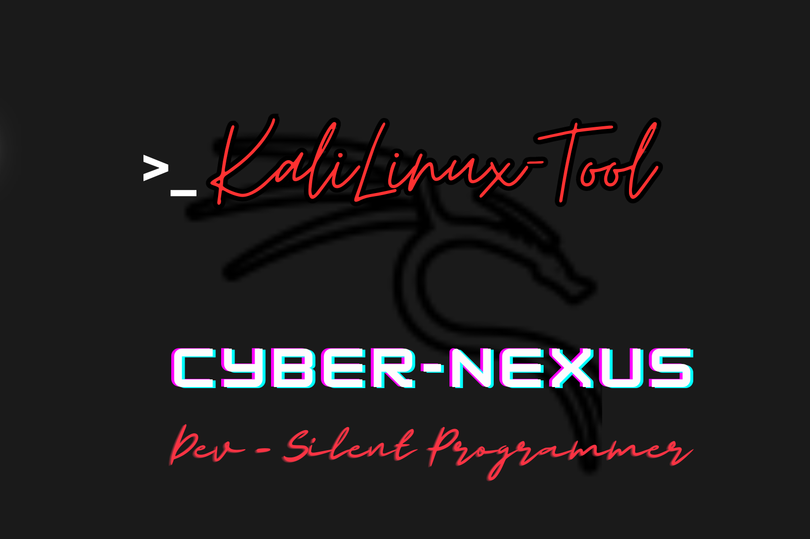

# CyberNexus - Automated Kali Linux Installer for Termux



CyberNexus is a bash-based script that automates the installation of Kali Linux in Termux, allowing users to run Kali Linux on their Android devices without root access. It works seamlessly on both rooted and non-rooted Android devices, providing a convenient way to access Kali Linux tools on the go.

## Features
- Easy installation of Kali Linux in Termux.
- Compatible with both rooted and non-rooted Android devices.
- No root access required.
- Seamless integration with Termux environment.

## Installation
1. Open Termux on your Android device.
2. Clone this repository:

    ```bash
    git clone https://github.com/Tanmay-Tiwaricyber/CyberNexus.git
    ```

3. Navigate to the cloned directory:

    ```bash
    cd CyberNexus
    ```

4. Grant execute permission to the script:

    ```bash
    chmod +x CyberNexus.sh
    ```

5. Run the script:

    ```bash
    ./CyberNexus.sh
    ```

## Usage
After running the installation script, you can start Kali Linux in Termux using the following command:

```bash
startkali
